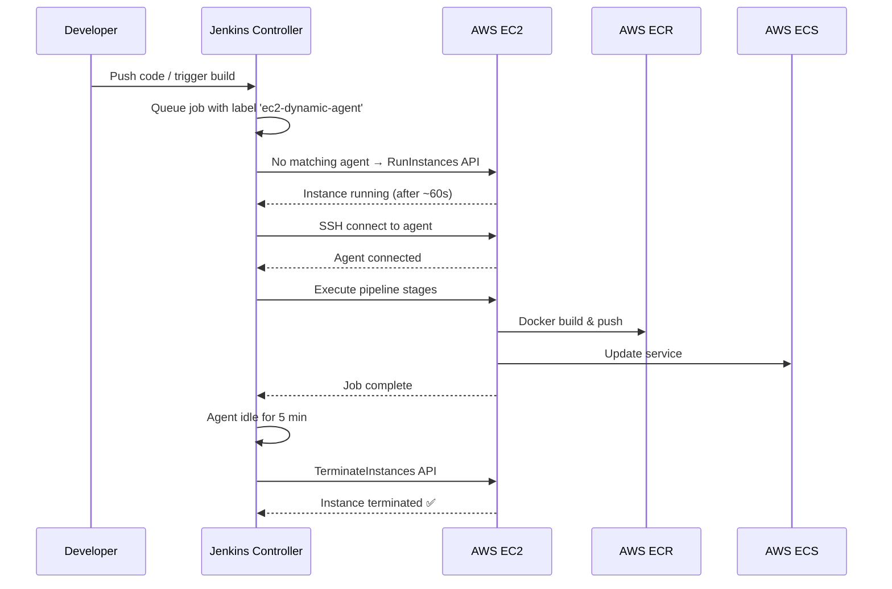

# Jenkins EC2 Cloud Agent — Complete Setup Guide

> Your goal: Jenkins spins up a **fresh EC2 instance** for each pipeline run, executes the job, then **terminates the instance** automatically.

---

## Table of Contents
1. [AWS Prerequisites](#1-aws-prerequisites)
2. [Jenkins Cloud Configuration (field-by-field)](#2-jenkins-cloud-configuration)
3. [AMI Template Configuration (field-by-field)](#3-ami-template-configuration)
4. [Jenkinsfile Changes](#4-jenkinsfile-changes)
5. [Verification Checklist](#5-verification-checklist)

---

## 1. AWS Prerequisites

Before touching Jenkins, set up these AWS resources:

### 1a. IAM User (or Role) for Jenkins

Create an IAM user (e.g. `jenkins-ec2-plugin`) with this **inline policy** (or attach as managed policy):

```json
{
  "Version": "2012-10-17",
  "Statement": [
    {
      "Sid": "EC2PluginPermissions",
      "Effect": "Allow",
      "Action": [
        "ec2:DescribeInstances",
        "ec2:DescribeRegions",
        "ec2:DescribeImages",
        "ec2:DescribeAvailabilityZones",
        "ec2:DescribeSecurityGroups",
        "ec2:DescribeSubnets",
        "ec2:DescribeKeyPairs",
        "ec2:DescribeSpotInstanceRequests",
        "ec2:DescribeInstanceTypes",
        "ec2:RunInstances",
        "ec2:TerminateInstances",
        "ec2:StartInstances",
        "ec2:StopInstances",
        "ec2:CreateTags",
        "ec2:GetConsoleOutput"
      ],
      "Resource": "*"
    },
    {
      "Sid": "PassRoleToEC2AgentOnly",
      "Effect": "Allow",
      "Action": "iam:PassRole",
      "Resource": "arn:aws:iam::817690546479:role/jenkins-agent-ec2-role",
      "Condition": {
        "StringEquals": {
          "iam:PassedToService": "ec2.amazonaws.com"
        }
      }
    }
  ]
}
```

> [!WARNING]
> Replace `817690546479` with your actual AWS account ID, and `jenkins-agent-ec2-role` with the exact name of the IAM role you created in step 1e. The `iam:PassedToService` condition ensures this role can only be passed to EC2, not to any other AWS service.

Generate an **Access Key ID** and **Secret Access Key** for this user — you'll need them below.

> [!TIP]
> If your Jenkins controller is itself running on EC2, you can skip the IAM user and use an **IAM Instance Profile** instead. Tick "Use EC2 instance profile to obtain credentials" and attach the above policy to the instance role.

### 1b. EC2 Key Pair

Create (or use an existing) EC2 key pair in **ap-south-1**:
```bash
aws ec2 create-key-pair --key-name jenkins-agent-key --region ap-south-1 \
  --query 'KeyMaterial' --output text > jenkins-agent-key.pem
chmod 400 jenkins-agent-key.pem
```
You'll paste the **private key** content into Jenkins credentials.

### 1c. Security Group

Create a security group (e.g. `jenkins-agent-sg`) that allows:

| Rule | Port | Source | Purpose |
|------|------|--------|---------|
| Inbound SSH | 22 | Jenkins controller SG / IP | Jenkins connects to agent |
| Outbound ALL | 0-65535 | 0.0.0.0/0 | Agent pulls code, Docker images, pushes to ECR |

```bash
aws ec2 create-security-group \
  --group-name jenkins-agent-sg \
  --description "Jenkins EC2 dynamic agents" \
  --vpc-id vpc-XXXXXXXX \
  --region ap-south-1

# Allow SSH from Jenkins controller
aws ec2 authorize-security-group-ingress \
  --group-name jenkins-agent-sg \
  --protocol tcp --port 22 \
  --source-group <jenkins-controller-sg-id> \
  --region ap-south-1
```

### 1d. AMI (Amazon Machine Image)

You need an AMI with your build tools pre-installed. Two options:

**Option A — Build your own AMI (recommended):**
1. Launch an Ubuntu 22.04 LTS instance (`ami-0c7217cdde317cfec` in ap-south-1)
2. SSH in and install:
```bash
# Java (required for Jenkins agent)
sudo apt update && sudo apt install -y openjdk-17-jdk-headless

# Docker
sudo apt install -y docker.io
sudo systemctl enable docker
sudo usermod -aG docker ubuntu

# AWS CLI v2
curl "https://awscli.amazonaws.com/awscli-exe-linux-x86_64.zip" -o "awscliv2.zip"
sudo apt install -y unzip && unzip awscliv2.zip && sudo ./aws/install

# jq (needed for ECS deploy stage)
sudo apt install -y jq

# Git
sudo apt install -y git
```
3. Create an AMI from this instance: **EC2 Console → Instance → Actions → Image → Create Image**
4. Note down the **AMI ID** (e.g. `ami-0abcdef1234567890`)

**Option B — Use stock Ubuntu AMI** and install everything via Init Script (slower but simpler to maintain).

### 1e. IAM Instance Profile for the Agent EC2

Your agent EC2 needs permissions to push to ECR and deploy to ECS. Create an IAM role (e.g. `jenkins-agent-ec2-role`) with these policies:
- `AmazonEC2ContainerRegistryPowerUser` — to push Docker images to ECR
- `AmazonECS_FullAccess` — to update ECS services/task definitions
- `AmazonSSMManagedInstanceCore` — (optional, for debugging)

Attach this role as an **Instance Profile** and note its ARN.

---

## 2. Jenkins Cloud Configuration

Navigate to: **Manage Jenkins → Clouds → New Cloud**

### Top-Level Cloud Settings

| Field | What to Enter | Explanation |
|-------|---------------|-------------|
| **Name** | `aws-ec2-cloud` | Any descriptive name. Shows in Jenkins UI. |
| **Amazon EC2 Credentials** | Select your AWS credential (see below) | The Access Key ID / Secret Key of the IAM user from step 1a. |
| **Use EC2 instance profile** | ☐ Unchecked (unless Jenkins is on EC2 with a role) | If Jenkins controller has an IAM role, check this and leave credentials as "none". |
| **Alternate EC2 Endpoint** | *(leave blank)* | Only needed for GovCloud or custom endpoints. |
| **Region** | `ap-south-1` | Must match where your resources are. Will auto-populate after credentials are set. |
| **EC2 Key Pair's Private Key** | Select your SSH credential (see below) | The `.pem` private key from step 1b. |
| **Instance Cap** | `2` | Max 2 EC2 agents at any time (one per pipeline). Prevents runaway costs. Increase if you run them in parallel. |
| **No delay provisioning** | ☑ Checked | Launch the EC2 immediately when a job is queued. Don't wait. |
| **Arn Role** | *(leave blank)* | Only needed if Jenkins assumes a cross-account role. |
| **Session Name** | *(leave blank)* | Only relevant when Arn Role is set. |
| **Clean Up Orphan Nodes** | ☑ Checked | Auto-cleanup orphaned agents from previous crashed runs. |

### Adding AWS Credentials to Jenkins

Before filling the form, add two credentials under **Manage Jenkins → Credentials → System → Global credentials**:

**Credential 1 — AWS Access Key:**
- Kind: `AWS Credentials`
- ID: `jenkins-ec2-aws-creds`
- Access Key ID: *(from step 1a)*
- Secret Access Key: *(from step 1a)*

**Credential 2 — SSH Private Key:**
- Kind: `SSH Username with private key`
- ID: `jenkins-agent-ssh-key`
- Username: `ubuntu` (for Ubuntu AMIs) or `ec2-user` (for Amazon Linux)
- Private Key: Enter directly → paste the entire contents of `jenkins-agent-key.pem`

After adding, click **Test Connection**. You should see `Success`.

---

## 3. AMI Template Configuration

Click **Add** under "AMIs" section. Fill in each field:

### AMI Core Settings

| Field | What to Enter | Explanation |
|-------|---------------|-------------|
| **Description** | `Ubuntu 22.04 Docker Agent` | Human-readable name for this AMI template. |
| **AMI ID** | `ami-0abcdef1234567890` | Your custom AMI ID from step 1d. Click **Check AMI** to validate. |
| **AMI Owners** | *(your AWS account ID, e.g. `817690546479`)* | Restricts AMI lookups to your account. Use `self` or your account ID. |
| **AMI Users** | *(leave blank)* | Only needed if sharing AMI across accounts. |
| **AMI Filters** | *(leave blank)* | Only needed if auto-discovering AMIs by tags instead of using AMI ID. |

### Instance Settings

| Field | What to Enter | Explanation |
|-------|---------------|-------------|
| **Instance Type** | `t3.medium` or `t3.large` | `t3.medium` (2 vCPU, 4 GB) for backend. `t3.large` (2 vCPU, 8 GB) for frontend (Next.js builds need more RAM). For a single AMI serving both, use `t3.large`. |
| **EBS Optimized** | ☑ Checked | Better disk I/O for Docker builds. Free on t3 instances. |
| **Monitoring** | ☐ Unchecked | Detailed CloudWatch monitoring. Optional — costs extra. |
| **T2 Unlimited** | ☐ Unchecked | Allows unlimited CPU bursting. Can cause surprise costs. Leave unchecked. |
| **Availability Zone** | *(leave blank)* | Let AWS pick the cheapest AZ. Or set a specific one if your VPC requires it. |

### Spot Configuration

| Field | What to Enter | Explanation |
|-------|---------------|-------------|
| **Use Spot Instances** | ☑ Checked *(optional but saves ~60-70% cost)* | Spot instances are much cheaper but can be interrupted. Fine for CI/CD since jobs are retryable. |
| **Spot Max Bid Price** | `0.05` | Max you'll pay per hour. `t3.large` spot is typically ~$0.02-0.03/hr. |
| **Fallback to On-Demand** | ☑ Checked | If no spot capacity, fall back to on-demand so builds don't get stuck. |

### Network & Access

| Field | What to Enter | Explanation |
|-------|---------------|-------------|
| **Security group names** | `jenkins-agent-sg` | The SG from step 1c. You can specify by name or ID. |
| **Subnet ID** | *(your public subnet ID)* | Put in **Advanced** section. Must be a subnet where the agent can reach Jenkins and the internet. |
| **Associate Public IP** | ☑ Checked | In **Advanced**. Needed if the agent is in a public subnet. |
| **IAM Instance Profile** | `jenkins-agent-ec2-role` | In **Advanced**. The IAM role from step 1e. Gives the agent ECR/ECS permissions. |

### Remote Connection Settings

| Field | What to Enter | Explanation |
|-------|---------------|-------------|
| **Remote FS root** | `/home/ubuntu/jenkins` | Working directory on the agent. Will be created automatically. |
| **Remote user** | `ubuntu` | SSH username. `ubuntu` for Ubuntu AMIs, `ec2-user` for Amazon Linux. |
| **AMI Type** | `unix` | Your AMI is Linux-based. |
| **Root command prefix** | *(leave blank)* | Only needed if commands require sudo prefix. |
| **Slave command prefix** | *(leave blank)* | Prefix before the agent.jar launch command. Usually not needed. |
| **Slave command suffix** | *(leave blank)* | Suffix after the agent.jar launch command. Usually not needed. |
| **Remote ssh port** | `22` | Standard SSH port. |
| **Boot Delay** | `30` | Seconds to wait after instance starts before trying SSH. EC2 takes ~20-30s to become SSH-ready. |

### Agent Behavior

| Field | What to Enter | Explanation |
|-------|---------------|-------------|
| **Labels** | `ec2-dynamic-agent` | **This is what your Jenkinsfile references.** Jobs with `agent { label 'ec2-dynamic-agent' }` will trigger EC2 provisioning. |
| **Usage** | `Only build jobs with label expressions matching this node` | **CRITICAL**: Choose this option so Jenkins doesn't run random jobs on these expensive agents. Only jobs explicitly requesting the `ec2-dynamic-agent` label will be scheduled here. |
| **Idle termination time** | `5` | Minutes of idle time before the EC2 instance is terminated. `5` is a good balance — gives a buffer in case another job starts soon, but doesn't waste money. Use `0` for immediate termination after the job. |
| **Terminate idle agents during shutdown** | ☑ Checked | When Jenkins shuts down, terminate any idle EC2 agents. |

### Init Script

> [!IMPORTANT]
> If you used **Option A** (custom AMI with tools pre-installed), this can be minimal. If you used **Option B** (stock AMI), put all installation commands here.

**For Option A (custom AMI) — minimal init script:**
```bash
#!/bin/bash
set -e

# Ensure Docker is running
sudo systemctl start docker
sudo usermod -aG docker ubuntu || true

# Create workspace
mkdir -p /home/ubuntu/jenkins

echo "Agent ready"
```

**For Option B (stock Ubuntu AMI) — full init script:**
```bash
#!/bin/bash
set -ex

# Update system
sudo apt-get update -y

# Install Java 17 (required for Jenkins agent)
sudo apt-get install -y openjdk-17-jdk-headless

# Install Docker
sudo apt-get install -y docker.io
sudo systemctl enable docker && sudo systemctl start docker
sudo usermod -aG docker ubuntu

# Install AWS CLI v2
curl -fsSL "https://awscli.amazonaws.com/awscli-exe-linux-x86_64.zip" -o /tmp/awscliv2.zip
cd /tmp && unzip -qo awscliv2.zip && sudo ./aws/install
cd -

# Install jq and git
sudo apt-get install -y jq git unzip

# Create workspace
mkdir -p /home/ubuntu/jenkins

echo "Agent init complete"
```

### Advanced AMI Settings

Click **Advanced** under the AMI section for these additional fields:

| Field | What to Enter | Explanation |
|-------|---------------|-------------|
| **Number of Executors** | `1` | One build at a time per agent. Keeps builds isolated. |
| **Subnet ID for VPC** | `subnet-xxxxxxxx` | Your VPC subnet. Must have internet access (NAT gateway or public subnet + public IP). |
| **Associate Public IP** | ☑ Checked | Required if using a public subnet. |
| **Instance Profile (IAM Role)** | `jenkins-agent-ec2-role` | ARN or name of the instance profile from step 1e. |
| **Block Device Mapping** | `/dev/sda1=:30:true:gp3` | 30 GB root volume, gp3 type, delete on termination. Docker images need disk space. |
| **Tags** | `Name=jenkins-dynamic-agent` | Tags applied to the EC2 instance for identification and cost tracking. |
| **Instance Cap (per AMI)** | `2` | Max instances from this specific AMI. |
| **Connection Strategy** | `Private IP` or `Public IP` | Use `Public IP` if Jenkins is external. Use `Private IP` if Jenkins is in the same VPC. |
| **Host Key Verification Strategy** | `off` | Disable SSH host key verification since each agent is a new instance with a new host key. |

---

## 4. Jenkinsfile Changes

Update the `agent` label in both Jenkinsfiles from `ec2-static-agent` to `ec2-dynamic-agent`:

### Jenkinsfile.backend — Change

```diff
 pipeline {
-    agent { label 'ec2-static-agent' }
+    agent { label 'ec2-dynamic-agent' }
```

### Jenkinsfile.frontend — Change

```diff
 pipeline {
-    agent { label 'ec2-static-agent' }
+    agent { label 'ec2-dynamic-agent' }
```

> [!NOTE]
> When Jenkins sees a job requesting `agent { label 'ec2-dynamic-agent' }` and no agent with that label exists, the EC2 Cloud plugin kicks in and provisions one. Once the job finishes and the agent is idle for the configured termination time (5 min), the instance is terminated.

### How the Lifecycle Works



---

## 5. Verification Checklist

After saving the cloud config, verify everything works:

| Step | Action | Expected Result |
|------|--------|-----------------|
| 1 | Click **Test Connection** in cloud config | "Success" message |
| 2 | Click **Check AMI** next to AMI ID | AMI details displayed |
| 3 | Trigger a backend pipeline manually | EC2 instance appears in AWS console with `jenkins-dynamic-agent` tag |
| 4 | Watch Jenkins build log | Should show "Provision" → "Launch" → job runs → completes |
| 5 | Wait 5 min after job completes | EC2 instance terminated in AWS console |
| 6 | Check **Manage Jenkins → Nodes** | Dynamic agent node disappears after termination |

### Common Troubleshooting

| Problem | Likely Cause | Fix |
|---------|-------------|-----|
| "No AMI matches" | Wrong AMI ID or region | Double-check AMI ID is in ap-south-1 |
| Agent never connects | Security group blocks SSH (port 22) | Add inbound rule from Jenkins controller IP/SG |
| "Permission denied (publickey)" | Wrong key pair or username | Ensure SSH credential username is `ubuntu` and key matches the key pair |
| Docker permission denied on agent | User not in docker group | Add `sudo usermod -aG docker ubuntu` to Init Script + reboot/newgrp |
| ECR push fails on agent | Missing IAM Instance Profile | Attach `jenkins-agent-ec2-role` instance profile in AMI Advanced settings |
| Instance never terminates | Idle termination not configured | Set idle termination time to `5` (minutes) |
| Boot too slow | Init Script installing everything | Build a custom AMI with tools pre-installed (Option A) |

---

## Quick Reference — Final Field Values

```
┌─────────────────────────────────────────────────────────────┐
│                   CLOUD SETTINGS                            │
├─────────────────────────────────────────────────────────────┤
│ Name:                     aws-ec2-cloud                     │
│ Credentials:              jenkins-ec2-aws-creds             │
│ Region:                   ap-south-1                         │
│ Key Pair:                 jenkins-agent-ssh-key              │
│ Instance Cap:             2                                 │
│ No delay provisioning:    ✓                                 │
│ Clean Up Orphan Nodes:    ✓                                 │
├─────────────────────────────────────────────────────────────┤
│                   AMI TEMPLATE                              │
├─────────────────────────────────────────────────────────────┤
│ Description:              Ubuntu 22.04 Docker Agent         │
│ AMI ID:                   <your-custom-ami-id>              │
│ Instance Type:            t3.large                          │
│ EBS Optimized:            ✓                                 │
│ Security Group:           jenkins-agent-sg                  │
│ Remote FS root:           /home/ubuntu/jenkins              │
│ Remote user:              ubuntu                            │
│ AMI Type:                 unix                              │
│ Remote ssh port:          22                                │
│ Boot Delay:               30                                │
│ Labels:                   ec2-dynamic-agent                 │
│ Usage:                    Only matching label expressions    │
│ Idle termination time:    5                                 │
│ Block Device:             /dev/sda1=:30:true:gp3            │
│ Host Key Verification:    off                               │
└─────────────────────────────────────────────────────────────┘
```

> [!CAUTION]
> **Cost awareness**: Each pipeline run launches a `t3.large` (~$0.0832/hr on-demand, ~$0.025/hr spot). With a 30-min pipeline + 5-min idle = ~35 min per run. That's about **$0.05 per run on-demand** or **$0.015 per run on spot**. Monitor your AWS bill!
